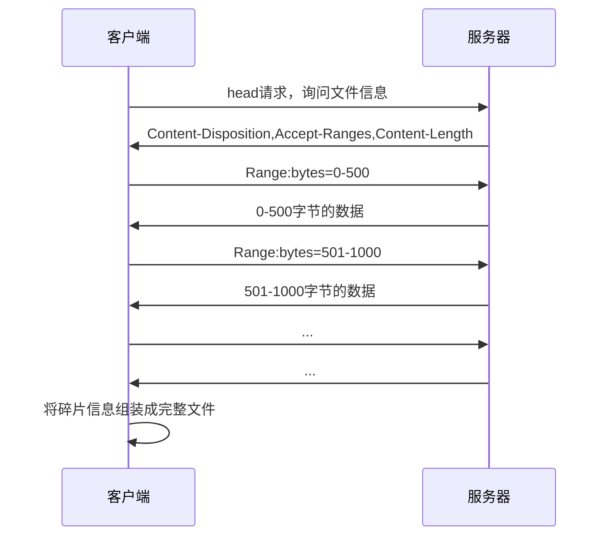
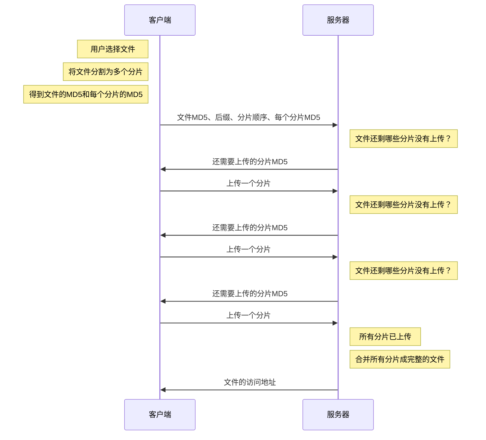

# 断点续传

## 下载

若要实现下载时的断点续传，首先，服务器在**响应时，要在头中加入下面的字段**

```
Accept-Ranges: bytes
```

这个字段是向客户端表明：我这个**文件可以支持传输部分数据，你只需要告诉我你需要的是哪一部分的数据即可，单位是字节**

此时，某些支持断点续传的客户端，比如迅雷，它就可以在请求时，**告诉服务器需要的数据范围**。具体做法是在请求头中加入下面的字段

```
range: bytes=0-5000
```

客户端告诉服务器：请给我传递 0-5000 字节范围内的数据即可，无须传输全部数据

完整流程如下



其中 HEAD 请求没有响应体，只有相应头（没有响应体的 get 请求）；接受到部分数据后会形成临时文件，如果传输中断，可以根据临时文件来继续发送后续的请求。

## 上传

整体来说，实现断点上传的主要思路就是把要上传的文件切分为多个小的数据块然后进行上传


虽然分片上传的整体思路一致，**但它没有一个统一的、具体的标准**，因此需要根据具体的业务场景制定自己的标准。

由于标准的不同，这也就意味着分片上传需要自行编写代码实现。

下面用一种极其简易的流程实现分片上传



哈希编码是一种将任意长度的输入数据（比如文本、文件等）转换为**固定长度的输出数据**的算法或过程。这种输出数据通常被称为“哈希值”或“散列值”。哈希编码的主要特点是：**即使输入数据只有微小的变化，输出的哈希值也会完全不同**。
哈希编码的几个关键点：

1. 单向性：哈希函数是不可逆的，也就是说，从哈希值无法反推出原始输入数据。
2. 固定输出长度：无论输入数据有多长，输出的哈希值长度是固定的（如 MD5 总是生成 128 位的哈希值）。
3. 抗碰撞性：理想的哈希函数应该保证不同的输入数据很少产生相同的哈希值（即“碰撞”）。
4. 快速计算：哈希函数应该能够高效地处理大量数据。

MD5 是一种具体的哈希算法。它将任意长度的输入数据生成一个 128 位的哈希值（通常表示为 32 个十六进制字符，例如 “d41d8cd98f00b204e9800998ecf8427e”）。MD5 曾经被广泛用于文件校验、密码存储等场景。

MD5 的特点：
输出长度：128 位（32 个十六进制字符）。
应用：文件完整性校验（如下载文件的校验）、数字签名、密码加密（虽然现在不推荐用于密码存储，因为安全性较低）。
缺点：随着计算能力的提高，MD5 已被发现存在安全漏洞，比如容易发生“碰撞”（即不同的输入生成相同的哈希值）。因此，在需要高安全性的场景中（如金融或敏感数据保护），已经不再推荐使用 MD5

## 示例服务器

### 下载

[http://localhost:8000/download/Wallpaper1.jpg](http://localhost:8000/download/Wallpaper1.jpg)

[http://localhost:8000/download/Wallpaper2.jpg](http://localhost:8000/download/Wallpaper2.jpg)

[http://localhost:8000/download/Wallpaper3.jpg](http://localhost:8000/download/Wallpaper3.jpg)

[http://localhost:8000/download/Wallpaper4.jpg](http://localhost:8000/download/Wallpaper4.jpg)

[http://localhost:8000/download/Wallpaper5.jpg](http://localhost:8000/download/Wallpaper5.jpg)

[http://localhost:8000/download/Wallpaper6.jpg](http://localhost:8000/download/Wallpaper6.jpg)

[http://localhost:8000/download/Wallpaper7.jpg](http://localhost:8000/download/Wallpaper7.jpg)

[http://localhost:8000/download/Wallpaper8.jpg](http://localhost:8000/download/Wallpaper8.jpg)

[http://localhost:8000/download/Wallpaper9.jpg](http://localhost:8000/download/Wallpaper9.jpg)

[http://localhost:8000/download/Wallpaper10.jpg](http://localhost:8000/download/Wallpaper10.jpg)

### 上传

#### 文件信息协商

**请求路径**：/api/upload/handshake

**请求方法**：POST

**字段**：

| 字段名   | 含义                                        | 是否必须 |
| -------- | ------------------------------------------- | -------- |
| fileId   | 文件的 MD5 编码                             | 是       |
| ext      | 文件的后缀，例如：.jpg                      | 是       |
| chunkIds | 文件分片的编号数组，每个编号是一个 MD5 编码 | 是       |
|          |                                             |          |

**可能的响应**：

```jsx
{
	code: 0,
  msg: '',
  data: '<http://localhost:8000/upload/a32d18.jpg>' // 服务器已有该文件，无须上传
}
```

```jsx
{
	code: 0,
  msg: '',
  data: ['md5-1', 'md5-2', 'md5-5'] // 服务器还需要上传的分片
}
```

**可能发生的失败响应**：

```jsx
{
	code: 403,
	msg: '请携带文件编号',
	data: null
}
```

#### 分片上传

**请求路径**：/api/upload

**请求方法**：POST

**字段**：

| 字段名  | 含义                    | 是否必须 |
| ------- | ----------------------- | -------- |
| file    | 分片的二进制数据        | 是       |
| chunkId | 分片的 MD5 编码         | 是       |
| fileId  | 分片所属文件的 MD5 编码 | 是       |
|         |                         |          |

**上传成功的响应**：

```jsx
{
	code: 0,
  msg: '',
  data: ['md5-2', 'md5-5'] // 服务器还需要上传的分片
}
```

**可能发生的失败响应**：

```jsx
{
	code: 403,
	msg: '请携带文件编号',
	data: null
}
```
