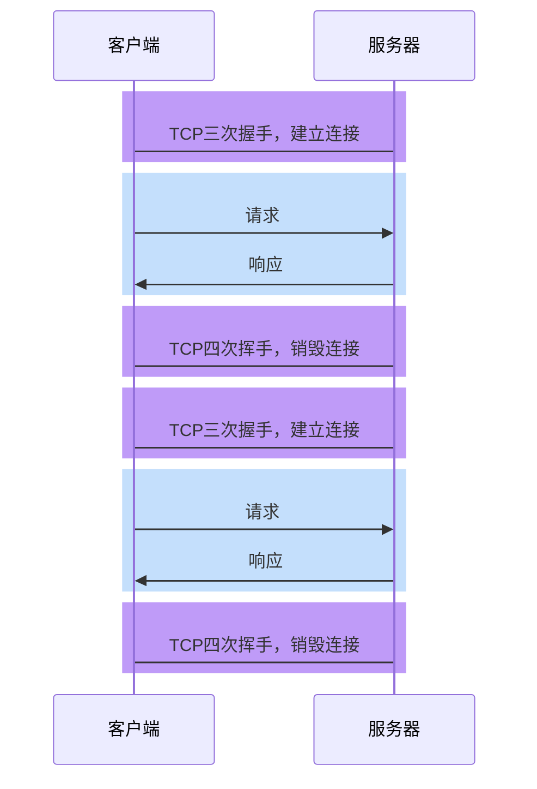
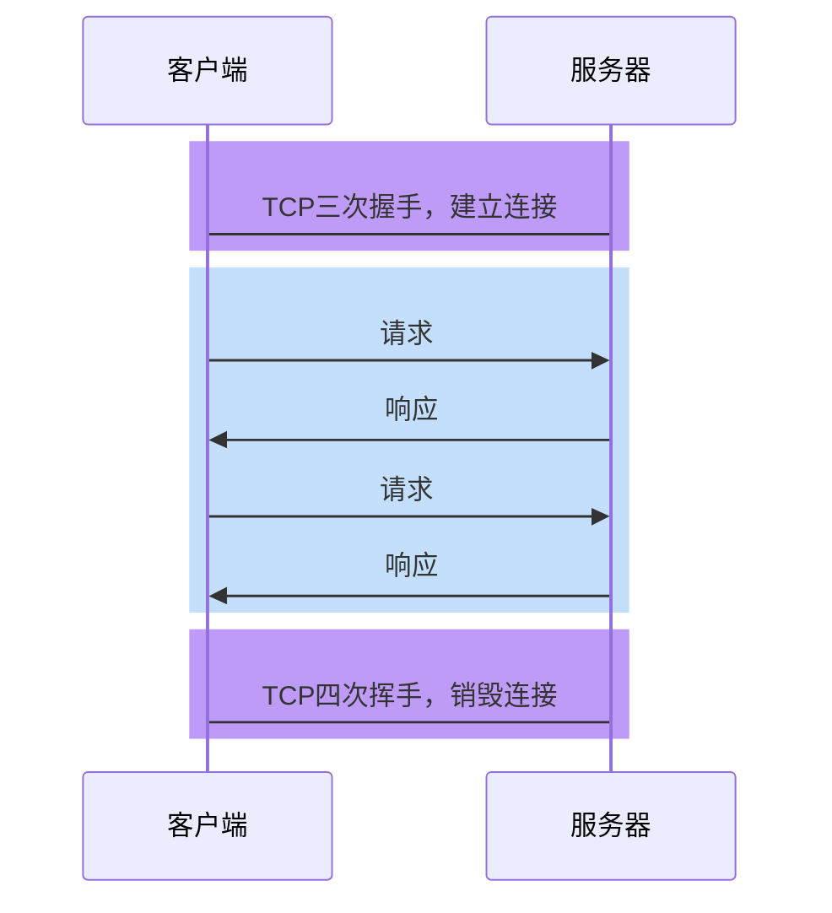

# HTTP 各版本差异

## HTTP1.0

### 无法复用连接

**HTTP1.0 为每个请求单独新开一个 TCP 连接**



由于每个请求都是独立的连接，因此会带来下面的问题：

1. 连接的建立和销毁都会占用服务器和客户端的资源，造成**内存资源的浪费**
2. **连接的建立和销毁都会消耗时间，造成响应时间的浪费**
3. **无法充分利用带宽，造成带宽资源的浪费**

    > TCP 协议的特点是「慢启动」，即一开始传输的数据量少，一段时间之后达到传输的峰值。而上面这种做法，会导致大量的请求在 TCP 达到传输峰值前就被销毁了（拥塞控制）

### 队头阻塞

HTTP/1.0 在**一个 TCP 连接上一次只处理一个请求**。客户端发送一个请求后，**必须等待服务器返回完整的响应，才能发送下一个请求**。这种**串行机制**意味着任何延迟都会直接影响后续请求。（必须等待上一个连接销毁之后，才能进行下一次请求）


## HTTP1.1

### 长连接

为了解决 HTTP1.0 的问题，**HTTP1.1 默认开启长连接**，即让**同一个 TCP 连接服务于多个请求-响应。**



在这种情况下，**多次请求响应可以共享同一个 TCP 连接，这不仅减少了 TCP 的握手和挥手时间，同时可以充分利用 TCP「慢启动」的特点，有效的利用带宽。**

> 实际上，在 HTTP1.0 后期，虽然没有官方标准，但开发者们慢慢形成了一个共识：
>
> **只要请求头中包含 Connection:keep-alive，就表示客户端希望开启长连接，希望服务器响应后不要关闭 TCP 连接。如果服务器认可这一行为，即可保持 TCP 连接。**（后续 http1.1 默认开启长连接）

当需要的时候，任何一方都可以关闭 TCP 连接

> 扩展知识
> 连接关闭的情况主要有三种：
>
> 1. 客户端在某一次请求中设置了`Connection:close`，服务器收到此请求后，响应结束立即关闭 TCP
> 2. 在没有请求时，客户端会不断对服务器进行**心跳检测**（一般每隔 1 秒）。一旦心跳检测停止，服务器立即关闭 TCP
> 3. 当客户端长时间没有新的请求到达服务器，服务器会主动关闭 TCP。运维人员可以设置该时间。

由于一个 TCP 连接可以承载多次请求响应，并在一段时间内不会断开，因此这种连接称之为长连接。

### 管道化和队头阻塞

HTTP1.1 允许在**响应到达之前发送下一个请求，这样可以大幅缩减带宽限制时间**

**但这样做会存在队头阻塞的问题**


由于多个请求使用的是同一个 TCP 连接，**服务器必须按照请求到达的顺序进行响应**

> 想一想为什么？

于是，导致了一些后发出的请求，无法在处理完成后响应，产生了等待的时间，而这段时间的带宽可能是空闲的，这就造成了带宽的浪费

队头阻塞虽然**发生在服务器**，但这个问题的根源是**客户端无法知晓服务器的响应是针对哪个请求**的。

正是由于存在队头阻塞，我们常常使用下面的手段进行优化：

-   通过**减少文件数量**，从而减少队头阻塞的几率
-   通过开辟多个 TCP 连接，实现真正的、有缺陷的并行传输
    > 浏览器会根据情况，为打开的页面自动开启 TCP 连接，对于同一个域名的连接最多 6 个
    > 如果要**突破这个限制，就需要把资源放到不同的域**中

**然而，管道化并非一个成功的模型，它带来的队头阻塞造成非常多的问题，所以现代浏览器默认是关闭这种模式的**

为什么管道化不能解决队头阻塞的问题？

因为**HTTP 协议的传输单位是 HTTP 文档（行、头、体构成），是不能分割的**。

## HTTP2.0


### 二进制分帧

**HTTP2.0 可以允许以更小的单元传输数据**，每个传输单元称之为**帧**，而**每一个请求或响应的完整数据**称之为**流**，每个流有自己的编号，每个帧会记录所属的流。

比如，服务器连续接到了客户端的两个请求，一个请求 JS、一个请求 CSS，两个文件如下：

```jsx
function a() {}
function b() {}
```

```css
.container {
}
.list {
}
```

最终形成的帧可能如下


可以看出，**每个帧都带了一个头部，记录了流的 ID**，这样做就能够准确的知道这一帧数据是属于哪个流的。


这样就真正的解决了共享 TCP 连接时的队头阻塞问题，实现了真正的**多路复用**

不仅如此，由于传输时是**以帧为单元传输**的，无论是响应还是请求，都可以实现并发处理，即**不同的传输可以交替进行**。

由于进行了分帧，还可以**设置传输优先级**。

### 头部压缩（HPACK）

HTTP2.0 之前，所有的消息头都是以字符的形式完整传输的

可实际上，**大部分头部信息在多次请求中都有很多的重复**

为了解决这一问题，HTTP2.0 使用头部压缩来减少消息头的体积


#### HPACK 的工作原理

HPACK 是 HTTP/2 专门设计的头部压缩算法，它结合了静态表、动态表和霍夫曼编码（Huffman Coding）来实现高效压缩。以下是其核心机制：

##### 静态表（Static Table）：

HPACK 内置了一张**预定义的静态表**，包含 61 个常见的头部字段及其典型值（如:method: GET、:status: 200、content-type: text/html 等）。
如果**请求或响应的头部字段匹配静态表中的条目，只需传输对应的索引号**（通常只需几个字节），而无需传输完整的字段名和值。

##### 动态表（Dynamic Table）：

动态表是一个客户端和服务器在通信过程中动态维护的表，**记录当前会话中出现过的头部字段及其值。**
当一个新的头部字段不在静态表中时，它会被添加到动态表中，并分配一个索引号。后续如果再次出现，只需引用该索引号即可。
动态表的大小有限（默认 4KB，可通过设置调整），当超出限制时会移除较早的条目（FIFO，先进先出）。

##### 霍夫曼编码（Huffman Coding）：

**对于不在静态表或动态表中的字段值，HPACK 使用霍夫曼编码进一步压缩字符串。**
霍夫曼编码是一种基于字符出现频率的无损压缩算法，常见字符会被编码为较短的位序列，从而减少数据大小。

##### 差量更新：

HPACK 支持仅传输头部字段的增量变化。例如，如果一个请求的头部与前一个请求相比只有 Cookie 值不同，只需传输变化的部分，而不是整个头部。

---

在 HTTP/1.0 和 HTTP/1.1 中，请求行是明文协议的一部分，通常以文本形式出现在请求的首行，例如：

```
GET /index.html HTTP/1.1
```

它包含方法（Method）、路径（Path）和协议版本（Protocol Version）。然而，HTTP/2 引入了二进制协议和帧（Frames）的概念，请求的结构发生了根本变化。

在 HTTP/2 中，**请求不再以明文的“请求行”形式传输，而是被分解为一系列的二进制帧**，其中最核心的是**HEADERS 帧**。具体来说：

-   **HEADERS 帧**：用于传输请求的头部信息，包括方法（:method）、路径（:path）、协议（:scheme）、主机（:authority）等伪头部字段（Pseudo-Header Fields）。这些字段替代了 HTTP/1.x 中的请求行和部分头部。
    -   例如，HTTP/1.1 中的 `GET /index.html HTTP/1.1` 在 HTTP/2 中会被编码为：
        ```
        :method: GET
        :path: /index.html
        :scheme: https
        :authority: example.com
        ```
-   **二进制格式**：HTTP/2 使用二进制编码，所有信息都以帧的形式传输，而不是文本。这提高了解析效率并减少了错误。

---

### 服务器推

HTTP2.0 允许在**客户端没有主动请求的情况下，服务器预先把资源推送给客户端**

当**客户端后续需要请求该资源时，则自动从之前推送的资源**中寻找

## 面试题

1. 介绍下 `http1.0`、`http1.1`、`http2.0` 协议的区别？

    > 参考答案：
    >
    > 首先说 http1.0
    >
    > 它的特点是每次请求和响应都对应一个 TCP 连接（包括三次握手和四次挥手），同时规定**前一个响应完成后才能发送下一个请求**。这样做有两个问题：
    >
    > 1. 无法复用连接
    >
    >     每次请求都要创建新的 TCP 连接，完成三次握手和四次挥手，网络利用率低
    >
    > 2. 队头阻塞
    >
    >     如果前一个请求被某种原因阻塞了，会导致后续请求无法发送。
    >
    > 然后是 http1.1
    >
    > http1.1 是 http1.0 的改进版，它做出了以下改进：
    >
    > 3. 长连接
    >
    >     http1.1 允许在请求时增加请求头`connection:keep-alive`，这样便允许后续的**客户端请求在一段时间内复用之前的 TCP 连接**
    >
    > 4. 管道化
    >
    >     基于长连接的基础，**管道化可以不等第一个请求响应继续发送后面的请求，但响应的顺序还是按照请求的顺序返回。**
    >
    > 5. 缓存处理
    >
    >     新增响应头 cache-control，用于实现客户端缓存。
    >
    > 6. 断点传输
    >
    >     在上传/下载资源时，如果资源过大，将其分割为多个部分，分别上传/下载，如果遇到网络故障，可以从已经上传/下载好的地方继续请求，不用从头开始，提高效率
    >
    > 最后是 http2.0
    >
    > http2.0 进一步优化了传输效率，它主要有以下改进：
    >
    > 7. 二进制分帧
    >
    >     将传输的消息分为更小的二进制帧，每帧有自己的标识序号，即便被随意打乱（同一个流中的顺序不能乱）也能在另一端正确组装
    >
    > 8. 多路复用
    >
    >     基于二进制分帧，在同一域名下所有访问都是从同一个 tcp 连接中走，并且不再有队头阻塞问题，也无须遵守响应顺序
    >
    > 9. 头部压缩
    >
    >     http2.0 通过字典的形式，将头部中的常见信息替换为更少的字符，极大的减少了头部的数据量，从而实现更小的传输量
    >
    > 10. 服务器推
    >
    >     http2.0 允许服务器直接推送消息给客户端，无须客户端明确的请求

2. 为什么 HTTP1.1 不能实现多路复用（腾讯）

    > 参考答案：
    >
    > HTTP/1.1 的传输单元是整个响应文本，因此接收方必须按序接收完所有的内容后才能接收下一个传输单元，否则就会造成混乱。而**HTTP2.0 的传输单元更小，是一个二进制帧，而且每个帧有针对所属流的编号，这样即便是不同的流交替传输，也可以很容易区分出每个帧是属于哪个流**的。

3. 简单讲解一下 http2 的多路复用（网易）

    > 在 HTTP/2 中，有两个非常重要的概念，分别是**帧（frame）和流（stream）**。 **帧代表着最小的数据单位，每个帧会标识出该帧属于哪个流，流也就是多个帧组成的数据流**。 多路复用，**就是在一个 TCP 连接中可以存在多条流**。换句话说，也就是可以发送多个请求，对端可以通过帧中的标识知道属于哪个请求。通过这个技术，可以避免 HTTP 旧版本中的队头阻塞问题，极大的提高传输性能。

4. http1.1 是如何复用 tcp 连接的？（网易）

    > **客户端请求服务器时，通过请求行告诉服务器使用的协议是 http1.1，同时在请求头中附带 connection:keep-alive（为保持兼容），告诉服务器这是一个长连接**，后续请求可以重复使用这一次的 TCP 连接。
    >
    > 这样做的好处是减少了三次握手和四次挥手的次数，一定程度上提升了网络利用率。但由于 http1.1 不支持多路复用，响应顺序必须按照请求顺序抵达客户端，不能真正实现并行传输，因此在 http2.0 出现之前，实际项目中往往把静态资源，比如图片，分发到不同域名下的资源服务器，以便实现真正的并行传输。

5. http1.0、http2.0、http3.0 之间的区别

    > 参考答案：
    >
    > http1.0
    >
    > 每次请求和响应完毕后都会销毁 TCP 连接，同时规定前一个响应完成后才能发送下一个请求。这样做有两个问题：
    >
    > 1. 无法复用连接
    >
    >     每次请求都要创建新的 TCP 连接，完成三次握手和四次挥手，网络利用率低
    >
    > 2. 队头阻塞
    >
    >     如果前一个请求被某种原因阻塞了，会导致后续请求无法发送。
    >
    > http2.0
    >
    > http2.0 优化了传输效率，它主要有以下改进：
    >
    > 3. 二进制分帧
    >
    >     将传输的消息分为更小的二进制帧，每帧有自己的标识序号，即便被随意打乱也能在另一端正确组装
    >
    > 4. 多路复用
    >
    >     基于二进制分帧，在同一域名下所有访问都是从同一个 tcp 连接中走，并且不再有队头阻塞问题，也无须遵守响应顺序
    >
    > 5. 头部压缩
    >
    >     http2.0 通过字典的形式，将头部中的常见信息替换为更少的字符，极大的减少了头部的数据量，从而实现更小的传输量
    >
    > 6. 服务器推
    >
    >     http2.0 允许服务器直接推送消息给客户端，无须客户端明确的请求
    >
    > http3.0
    >
    > http3.0 目前还在草案阶段，**它完全抛弃了 TCP 协议（TCP 存在队头阻塞问题），转而使用 UDP 协议**，是为了进一步提升性能。
    >
    > 虽然 http2.0 进行了大量的优化，但它无法摆脱 TCP 协议本身的问题，比如建立连接时间长、对头阻塞问题等等。
    >
    > 为了保证传输的可靠性，http3.0 使用了 QUIC 协议。
